# Звіт 33: закрити «Карту 1.0»

Частина А — 07.10.2026, паралельно з перенавчанням (`ZAVDANNYA-32`, ч. 8).
Частина Б — після нього.

## Частина А

| Пункт | Було | Стало | Як перевірено |
|---|---|---|---|
| А1. Вкладка «Скарги» (35.10; 32, ч. 9) | скарг у картках не було | «Скарги (N)» поруч із «Рішення» в картці адреси, проблеми й соти (і стовпчика); у вікні ризику — рядок «Скарги (N)», що розгортає список. Скарг немає — вкладки немає | очима, світла й темна, ПК і телефон: просп. Свободи, 4 — 11 скарг = 11 рядків; сота навколо нього — 16 = 16; Богданівська (ризик) — 3 = 3; бульв. Чоколівський, 19 (проблема) — скарг у 30 м немає, вкладки немає |
| А2. Посилання на проблему (п. 15) | `#m=шир,довг` — лише адреса; спливний напис «скопійовано» | `#m=шир,довг,механізм` — стабільне між збірками; проблеми чи адреси вже немає — те саме місце без картки; відповідь на самій кнопці; на телефоні — меню «Поділитися» | нове вікно: пл. Вокзальна, 1 → картка «крадіжка», z16; зміна адреси в тій самій вкладці → Чоколівський, 19; неіснуючий механізм → місце без картки. «Поділитися» — перевірити з телефону на живій карті (Б2): у вбудованому браузері його немає |
| А3. Пункти 1, 4, 5, 8 | ⏳ / 🔶 | 1 ✅, 4 ✅, 8 ✅; 5 — після перенавчання | п. 1: у всіх 12 проблем подій у картці = рядків «Рішення»; Хрещатик, 19А — одна; Спортивна, 1А — одна картка, 3 механізми. П. 4: посібник лише за об'єктом OSM у 50 м — Майдан, 1: паб «Куппер» за 43 м, посібник про бари правильний; перевірку в KARTA переписано (Андрій 07.10). П. 8: `vykluchennya_ne.txt` порожній; «Хороброго, 9» у OSM досі не виправлено — задокументований виняток у `vykluchennya_moyi.txt` |
| А4. Автоматика (п. 16, 17, 18, 25) | `check_build` ішов після збереження стану | перевірка — до збереження; впала — у `main` нічого не йде, звіт моделі лишається артефактом запуску; автоперенавчання «перший тиждень місяця» — лише за розкладом | `check_build` повертає 1 при помилці → наступні кроки й публікація не запускаються. Розклади: «Знімок OSM» 28-го → «Прохідність» після нього → «Аналіз 1551» щонеділі → «Оновлення карти» щопонеділка, перенавчання — перший понеділок. `ZVIT-KROK7.md` пише версію, «Попередню версію» PAI і розділ «Зміни від попередньої версії» (чинники зайшли / вийшли) |
| А5. Корінь репо (п. 19) | 27 файлів | в `arkhiv/`: ZAVDANNYA-30, ZVIT-30, ZAVDANNYA-31, ZAVDANNYA-PROBLEMY-29, AUDYT-4, PEREDACHA-PROBLEMY, PLAN-KROK7, PLAN-BAZA; `1551-SKHOZHI-UMOVY.md` — у `doslidzhennya/` | лишено й чому: `NAPRYAM-PROBLEMY.md` — на його додаток Б посилається публічний звіт «Проблеми»; `INSTRUKTSIYA-DANI.md` — інструкція для Андрія ще не виконана; `ZVIT-KROK7.md`, `ZVIT-1551-ZAKONOMIRNOSTI.md` — їх пише workflow |
| А6. README для стороннього (п. 20) | опис локального ланцюга до Actions | одна сторінка: що це й для кого, джерела (усі відкриті), що карта показує й чого ні, як відтворити, документи | прочитано як людина ззовні |
| А7. Фабули (п. 3) | — | перекачування v4: черга 134 706 справ; за першу ніч (07.10) — 30 000, помилок 0; прохід щодня о 22:00 UTC сам, без втручання; при 30 тис. за ніч решта — до ночі на 11.10 | журнал запуску 37555955345 |

Попутно (Андрій 07.10):
- Підказка району на огляді міста накладалася на підказку соти —
  тепер над сотою, стовпчиком чи ризиком лише їхня.
- «Служба охорони "Стелс 1"» (Хороброго, 7) — приватна охорона під
  `amenity=police`; установою більше не вважається (помилка даних).

**Автоматика, стан на 07.10:** 5 запусків «Оновлення карти» за розкладом
поспіль зелені (07.09–05.10). Відлік «трьох поспіль» за завданням — з
12.10.

## Частина Б

ЧАСТИНА_Б

## Частина В — зауваження з живої карти

«Було» — жива карта 07.10 (збірка 37588708940, код 00b0455); «стало» —
локальна збірка з тими самими даними. Знімки — `doslidzhennya/znimky-33/`.

| Пункт | Було | Стало |
|---|---|---|
| В1 → В6. Стовпчики | 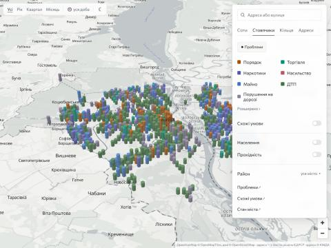 | 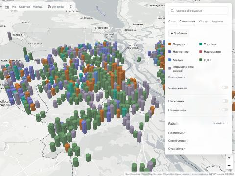 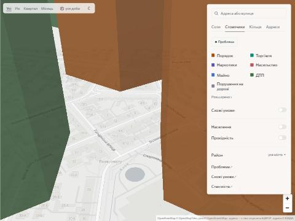 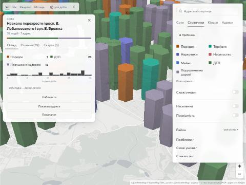 |
| В2. Колір соти | 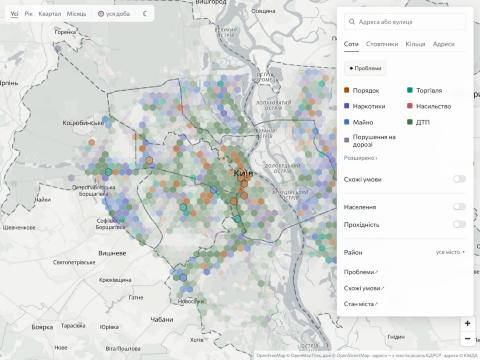 | 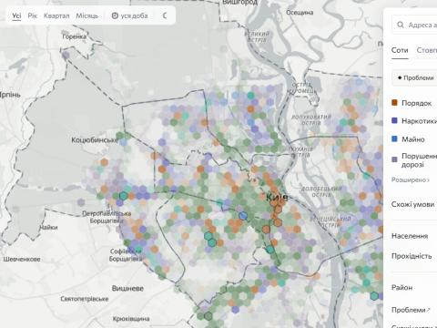 |
| В3. Назва соти біля Чоколівки | 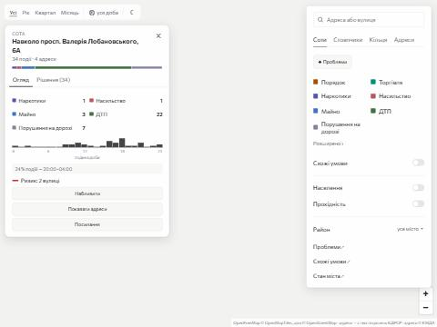 | 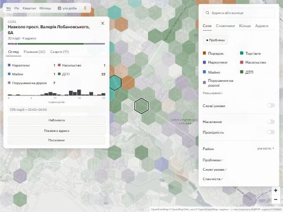 |
| В4. Сліди при перемиканні; підписи під кільцями | 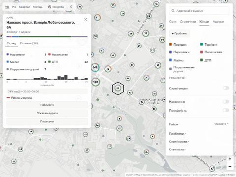 | 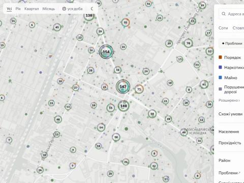 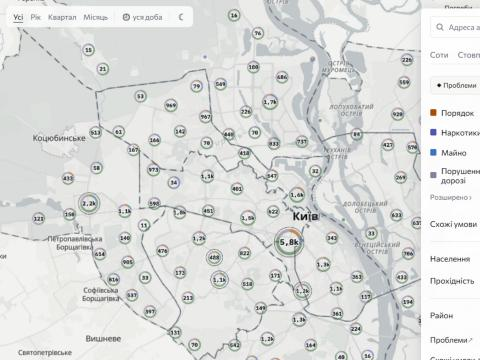 |
| В5. Спортивна, 1А | 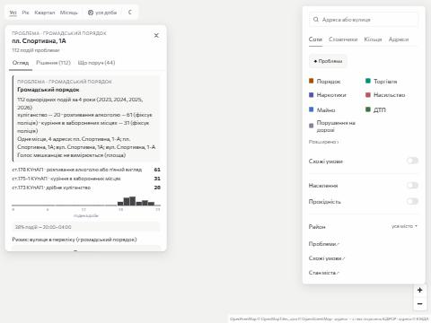 | 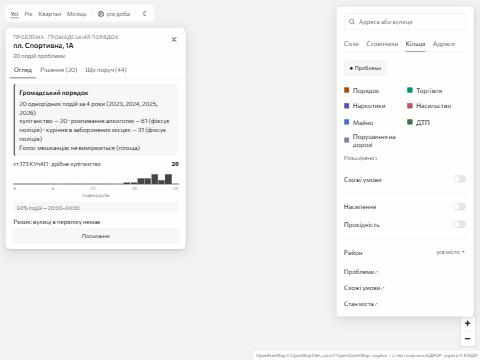 |

- **В6 (замість В1). Стовпчики** — одна сота 330 м на всіх масштабах, без
  розпаду на 130 і 30 м; колір, прозорість (0,8 / 0,85), освітлення й
  висота — як були. «Привидів» і голок немає; на z16 стовпчик заввишки з
  квартал — як у kepler.gl, для вулиці є «Показати адреси». Над стовпчиком
  — лише його підказка («39 подій · порушення на дорозі»), підказки району
  в стовпчиках немає. Контуру на землі немає ні для проблеми, ні для
  вибраного — вибраний стовпчик світліший, поки відкрита картка. Соти (2D)
  — як були, з перетіканням розмірів.
- **В2. Колір соти** — вид з найбільшим «частка в соті ÷ частка по місту»
  серед видів з ≥ max(3, 10% соти) подій. Раніше ще й поріг 1,5 і запасний
  «найчисленніший вид» — і майже все було зелене (ДТП). Тепер у центрі
  помаранчеві (порядок) і фіолетові соти, на околицях — зелені. Приклад:
  сота біля Лобановського — ДТП 23, порушень на дорозі 15, колір —
  порушення на дорозі (їх тут більше, ніж по місту).
- **В3. Назва соти** — адреса з найбільшою кількістю подій у соті.
  «Велика Васильківська, 21» у даних 07.10 стоїть на своєму місці (центр,
  50,4395 / 30,5177), а в соті #c=130,50.42288,30.46507 — лише адреси
  просп. Лобановського; і на живій карті, і локально сота зветься «Навколо
  просп. Валерія Лобановського, 6А». Причину на нинішніх даних відтворити
  не вдалося: найімовірніше, подію з «Велика Васильківська, 21» біля
  Чоколівки ставило старе геокодування однойменних адрес, виправлене в
  частині 2 (ZVIT-32) і застосоване в збірці 37588708940. Координат подій в
  історії git немає, тож довести не можу.
- **В4.** Зміна вигляду скидає картку, вибрану соту, вікно й посилання в
  адресі. Кільця — над підписами міста й районів (шар іде одразу після
  останнього шару підписів, під номерами «Що поруч»).
- **В5. Спортивна, 1А** — у картці виду число, роки, статті й «Рішення» —
  лише механізми, що пройшли ворота як заявні: **20 подій** (хуліганство)
  замість 112; розпивання (61) і куріння (31) — лише в розбивці з
  «(фіксує поліція)». Заявних немає — уся картка «Фіксує поліція». Одна
  адреса — одне написання (ключ `adr_kliuch` + той самий номер і повні
  слова однієї назви всередині другої): «пл./вул. Спортивна, 1-А/1А» —
  одна; так само «М.Незалежності», «В. Васильківська», «С. Русової».
  Перевірено на всіх 12 проблемах: дві адреси лишилися лише в «Хрещатик,
  19 / 19-А» — різні будинки. Заголовок «Проблема · вид» — лише в шапці.
  Роки в картці — явно («за 4 роки (2023, 2024, 2025, 2026)»), як у звіті
  «Проблеми».

## Що вимагає рішення Андрія

РІШЕННЯ_33
